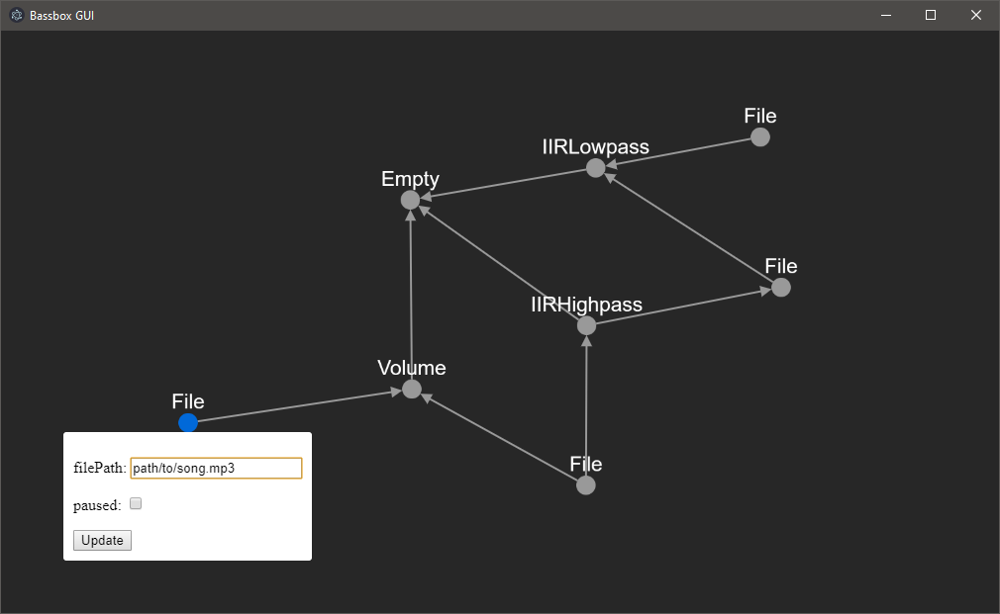

# Bassbox GUI
A GUI for [Bassbox](https://github.com/fwcd/bassbox) that lets the user graphically create and connect streaming audio nodes.

## Setup
* Run `npm install`
* Place the built Bassbox binary (e.g. `bassbox.exe`) in a new folder inside this repository named `local`

## Running
* Run `npm start`
